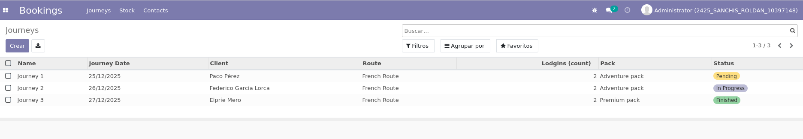
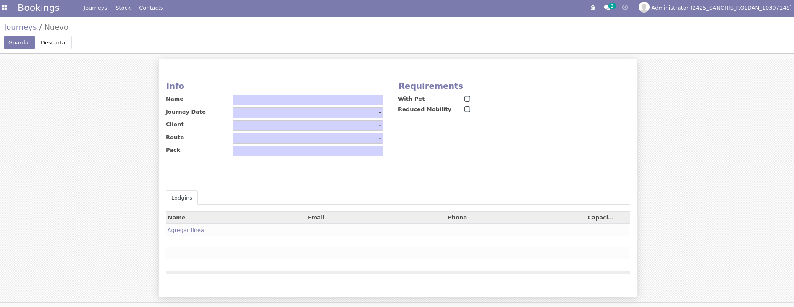
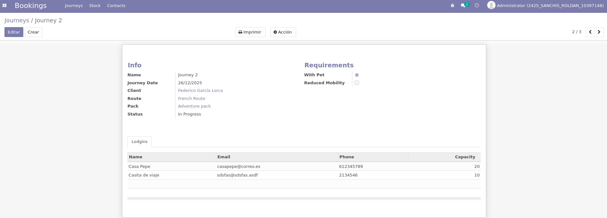
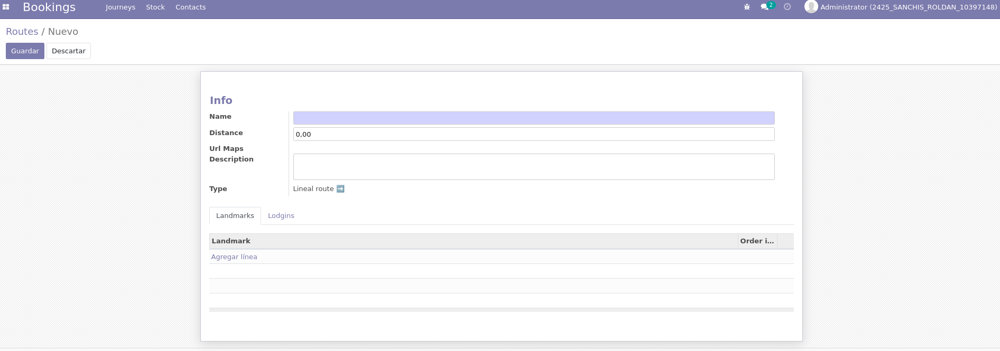
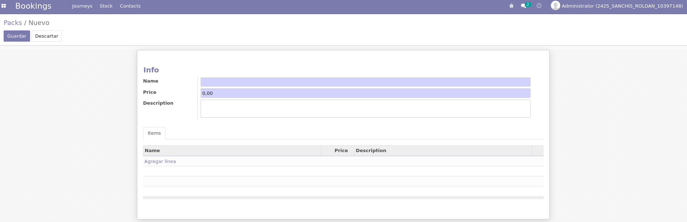
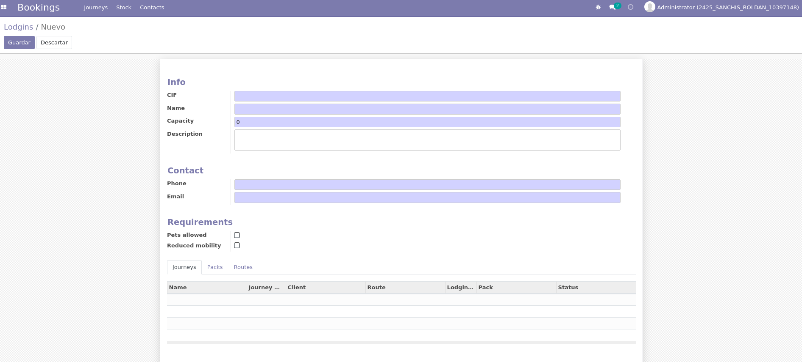

## Listado de Reservas

Vista inicial con todas las reservas registradas.

---

## Crear Reserva

Formulario para crear una nueva reserva asociada a un cliente, ruta y pack.

---

## Consultar Reserva

Pantalla para revisar los detalles de una reserva existente.

---

## Crear Ruta

Formulario para definir una nueva ruta de viaje.

---

## Crear Pack

Pantalla para configurar un nuevo pack con su respectivo precio y descripción.

---

## Crear Hospedaje

Formulario para registrar un nuevo hospedaje, incluyendo detalles como capacidad, accesibilidad y si admite mascotas.

